# 📊 InsightFlow

## Business Intelligence and Data Analytics Dashboard

InsightFlow is an interactive business analytics application built with Python and Streamlit. It allows users to upload their own sales datasets, map their columns to a standard structure, store the processed data in an SQLite database, and explore business insights through interactive dashboards and reports.

The application is designed to demonstrate a complete data analytics workflow, from raw data upload and validation to database storage, analysis, visualization, and report generation.

---

# 🚀 Features

## 📁 Dataset Upload and Column Mapping

- Upload datasets in CSV or Excel format.
- Map custom dataset column names to InsightFlow's required structure.
- Prevent the same uploaded column from being mapped multiple times.
- Automatically handle unavailable optional columns.
- Validate uploaded data before inserting it into the database.
- Detect invalid numeric and date values.
- Detect duplicate order records.

---

## 🗄️ SQLite Database Integration

InsightFlow uses SQLite as its backend database.

The application stores data across three related tables:

### 👥 Customers

Stores customer information including:

- Customer ID
- Customer Name
- Region
- City

### 📦 Products

Stores product information including:

- Product ID
- Product Name
- Category
- Sub-Category

### 🛒 Sales

Stores transactional sales information including:

- Order ID
- Order Date
- Customer ID
- Product ID
- Sales
- Quantity
- Discount
- Profit

The tables are connected using primary keys and foreign keys.

---

# 📈 Executive Dashboard

The Executive Dashboard provides an overall view of business performance.

### Key Performance Indicators

- 🛒 Total Orders
- 📦 Total Products
- 🙎‍♂️ Total Customers
- 💸 Total Sales
- 📈 Total Profit
- 📊 Average Order Value

### Visualizations

- Monthly Sales Trend
- Monthly Profit Trend
- Sales by Region
- Profit by Region
- Sales by Category
- Profit by Category

---

# 👥 Customer Insights

The Customer Insights page helps analyze customer behavior and contribution.

### Features

- Total Customers
- Repeat Customers
- Most Frequent Customer
- Customers Ranked by Number of Orders
- Top 10 Customers by Revenue
- Customer Segmentation

Customers are segmented into:

- 💎 High Value
- 👥 Regular
- 📉 Low Value

A pie chart provides a visual overview of customer segmentation.

---

# 📦 Product Performance

The Product Performance page provides insights into product-level business performance.

### Features

- Total Products
- Best Selling Product
- Most Profitable Product
- Overall Product Summary
- Top Selling Products
- Least Selling Products
- Top Profitable Products
- Product Sales Treemap

The application uses interactive Plotly visualizations to explore product performance.

---

# 📑 Reports

The Reports page allows users to generate filtered business reports.

### Available Filters

Users can filter data by:

- Category
- City
- Month
- Year

### Available Reports

- 🛒 Sales Table
- 👥 Customer Table
- 📦 Product Table
- 📋 Full Merged Table
- 📊 Business Summary Report
- 👥 Customer Report
- 📦 Product Report

All reports can be downloaded as CSV files.

---

# 🧠 Trends and Predictions

The Trends and Predictions section is currently under development.

Future versions of InsightFlow may include:

- Machine Learning Models
- Sales Forecasting
- Trend Prediction
- AI-Powered Business Insights
- Predictive Analytics

---

# 🛠️ Technologies Used

| Technology | Purpose |
|---|---|
| 🐍 Python | Core programming language |
| 📺 Streamlit | Web application and user interface |
| 🐼 Pandas | Data cleaning and analysis |
| 🔌 SQLite | Database management |
| 📊 Plotly | Interactive visualizations |

---

# 🗂️ Project Structure

```text
Project_InsightFlow/
│
├── app.py
├── main.py
├── database_functions.py
├── UI_customization.py
├── insightflow.db
├── requirements.txt
├── .gitignore
├── README.md
│
├── pages/
│   ├── customer_feedback.py
│   ├── executive_dashboard.py
│   ├── product_performance.py
│   ├── reports.py
│   ├── trends_and_forecast.py
│   └── upload_dataset.py
│
├── logos/
│   └── Project_logo.png
│
└── screenshots/
    ├── customer_insight_bottom.png
    ├── customer_insight_top.png
    ├── dashboard_bottom.png
    ├── dashboard_top.png
    ├── home_bottom.png
    ├── home_top.png
    ├── product_performance_bottom.png
    ├── product_performance_top.png
    ├── reports_bottom.png
    ├── reports_top.png
    ├── upload_dataset_initial.png
    └── upload_dataset_second.png
```

---

# ⚙️ Installation

## 1. Clone the Repository

```bash
git clone https://github.com/arjumand547/InsightFlow.git
```

## 2. Navigate to the Project Folder

```bash
cd Project_InsightFlow
```

## 3. Create a Virtual Environment

```bash
python -m venv .venv
```

### Activate the Virtual Environment

#### Windows

```bash
.venv\Scripts\activate
```

#### macOS / Linux

```bash
source .venv/bin/activate
```

---

## 4. Install Required Libraries

```bash
pip install -r requirements.txt
```

---

# ▶️ Run the Application

Run the following command:

```bash
streamlit run main.py
```

The application will start locally in your browser.

---

# 📸 Application Screenshots

## 🏠 Home Page

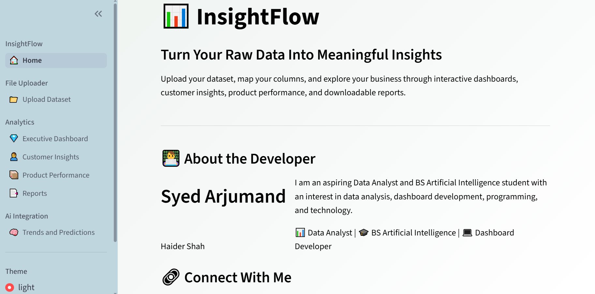

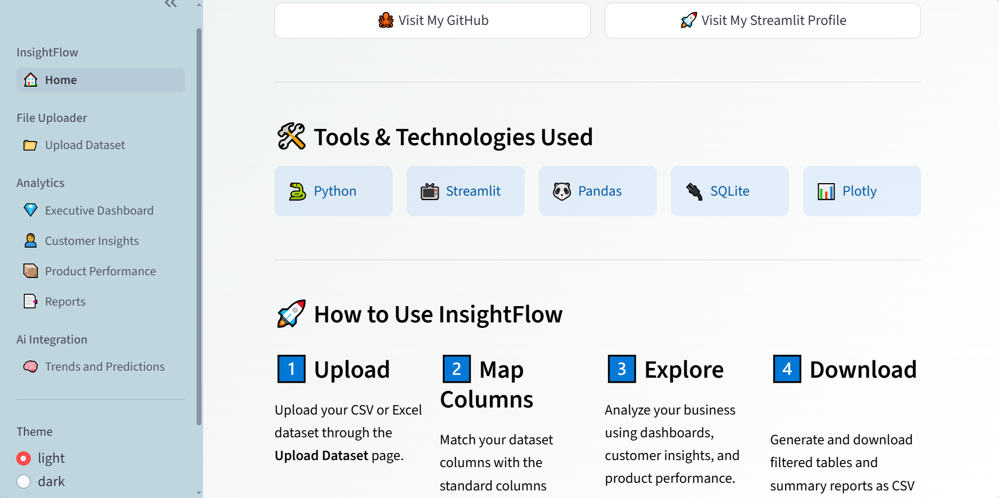

---

## 📈 Executive Dashboard

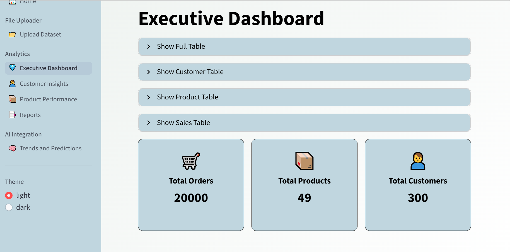

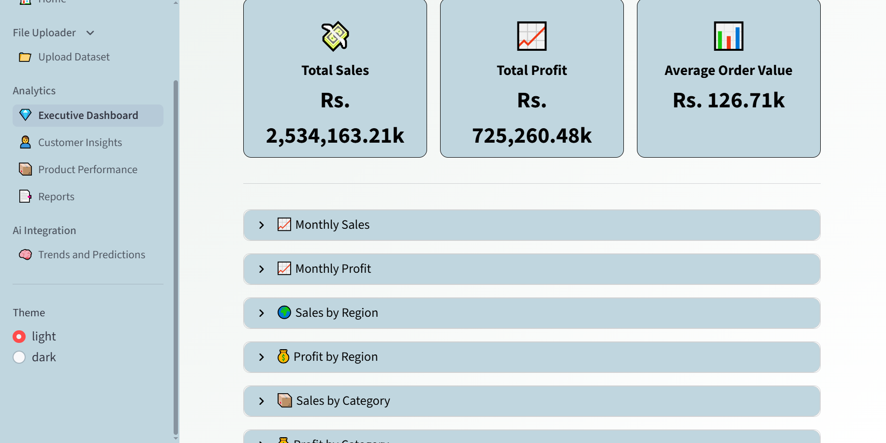

---

## 👥 Customer Insights

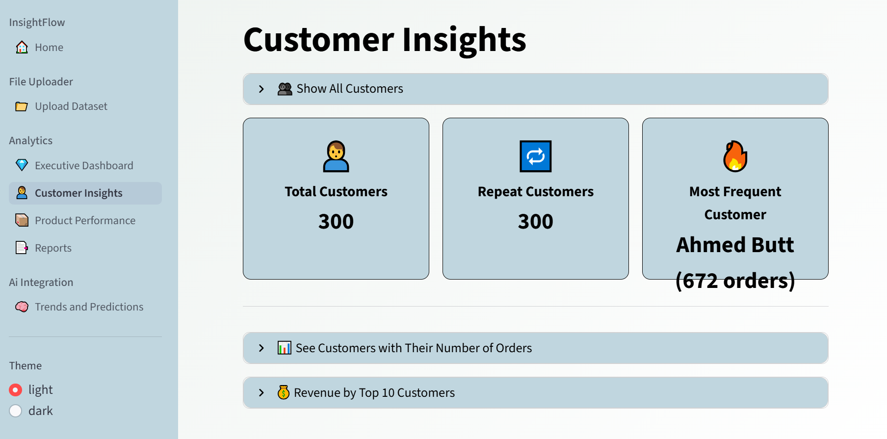

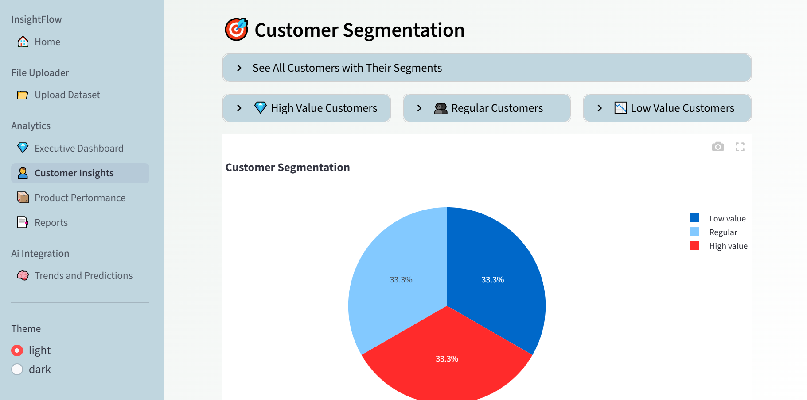

---

## 📦 Product Performance

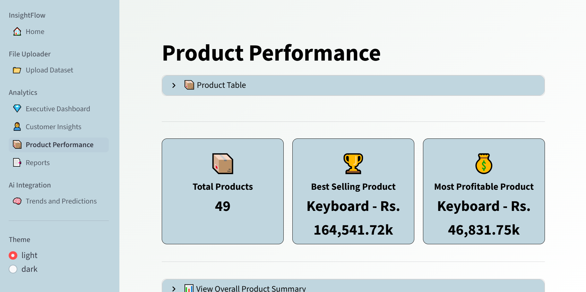

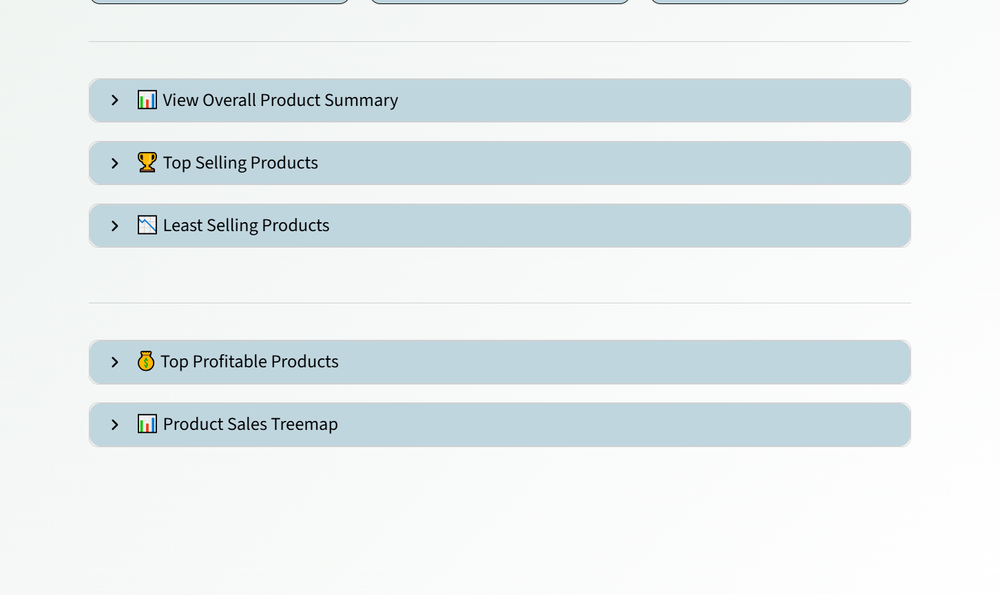

---

## 📑 Reports

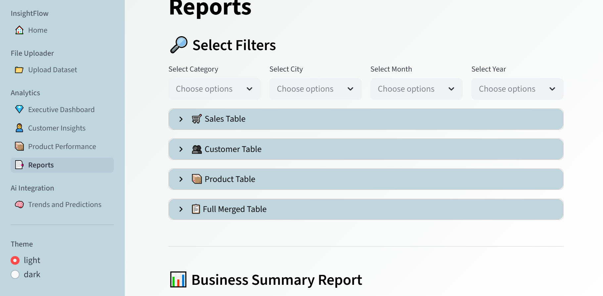

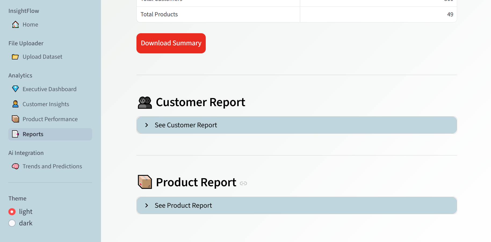

---

## 📁 Upload Dataset

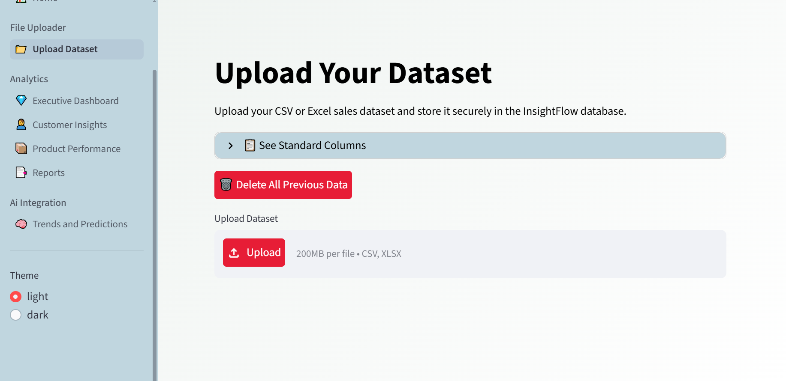

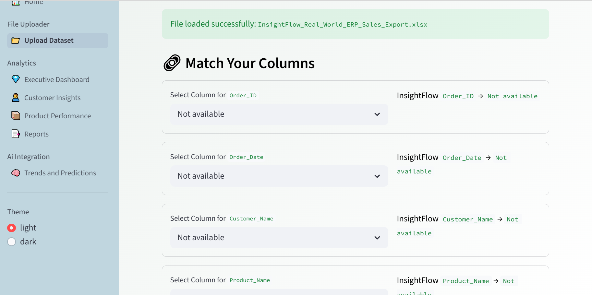

---

# 🔄 Application Workflow

```text
Upload Dataset
      ↓
Map Dataset Columns
      ↓
Validate Data Types
      ↓
Clean and Prepare Data
      ↓
Insert Customers into SQLite
      ↓
Insert Products into SQLite
      ↓
Map Customer and Product IDs
      ↓
Insert Sales into SQLite
      ↓
Analyze Data
      ↓
Generate Dashboards and Reports
```

---

# 📊 Database Design

InsightFlow follows a relational database structure.

```text
CUSTOMERS
│
├── Customer_ID (Primary Key)
├── Customer_Name
├── Region
└── City

        │
        │
        ▼

SALES
│
├── Sales_ID (Primary Key)
├── Order_ID
├── Order_Date
├── Customer_ID (Foreign Key)
├── Product_ID (Foreign Key)
├── Sales
├── Quantity
├── Discount
└── Profit

        ▲
        │
        │

PRODUCTS
│
├── Product_ID (Primary Key)
├── Product_Name
├── Category
└── Sub_Category
```

---

# 🎯 Key Concepts Demonstrated

This project demonstrates practical experience with:

- Data Cleaning
- Data Validation
- Data Type Conversion
- Missing Value Handling
- Duplicate Detection
- Relational Databases
- SQLite CRUD Operations
- Primary and Foreign Keys
- Pandas Data Analysis
- Data Merging
- GroupBy Operations
- Pivot Tables
- Customer Segmentation
- KPI Calculations
- Interactive Data Visualization
- Streamlit Session State
- File Upload Handling
- CSV Report Generation
- Git and GitHub

---

# 🔮 Future Improvements

Possible future improvements include:

- 🤖 Machine Learning Sales Forecasting
- 🧠 AI-powered insights
- 📈 Advanced predictive analytics
- 🔐 User authentication
- ☁️ Cloud database integration
- 📊 More advanced dashboard filtering
- 📄 PDF report generation
- 📧 Automated report sharing
- 🗃️ Support for larger datasets
- 🌐 Deployment with Streamlit Community Cloud

---

# 👨‍💻 Developer

**Syed Arjumand Haider Shah**

Aspiring Data Analyst | BS Artificial Intelligence Student | Dashboard Developer

### 🔗 Connect With Me

- 🐙 GitHub: https://github.com/arjumand547
- 🚀 Streamlit: https://share.streamlit.io/user/arjumand547

---

# ⭐ About This Project

InsightFlow was built as a portfolio project to demonstrate practical skills in data analytics, dashboard development, database management, and interactive data visualization.

The project focuses on building a complete analytics workflow where users can upload raw business data and transform it into meaningful insights through dashboards and downloadable reports.

---

⭐ If you find this project interesting, consider giving the repository a star!